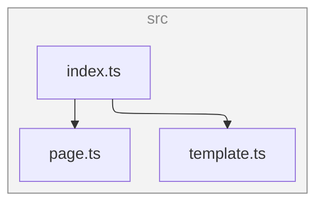

# Cheerio CMS

It's just a simple wrapper around [Cheerio](https://cheerio.js.org/) for server-side HTML manipulation and content management.

## Installation

```bash
npm install cheerio_cms
```

## Usage

```js
import { template, Page } from 'cheerio_cms';

const html = new Page(template)
	.setContent('<h1>Hello World!</h1>')
	.setTitle('hello world', 'simple hello world page')
	.render();
```

## Dependency Graph

<!--- This chapter is generated automatically --->



## License

Unlicensed
